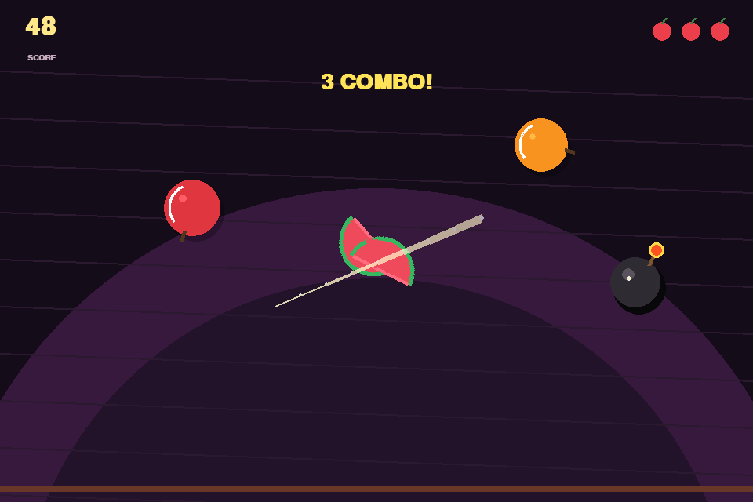

# 水果快斩（Fruit Slash）

<p align="center">
  <strong>瞄准、挥刀、连击——切开水果，同时避开混入其中的炸弹。</strong>
</p>

<p align="center">
  <a href="https://github.com/gaozihan3g/fruit-slash/actions/workflows/build-release.yml"></a>
  <a href="https://github.com/gaozihan3g/fruit-slash/releases/latest"></a>
  <a href="LICENSE"></a>
  
</p>



一个使用 Python 和 Pygame 编写的水果切割小游戏。水果、美术、刀光、粒子和动画全部由代码绘制，不需要额外素材包。

**[在线作品介绍](https://gaozihan3g.github.io/fruit-slash/)** · **[下载最新版本](https://github.com/gaozihan3g/fruit-slash/releases/latest)** · **[查看更新日志](CHANGELOG.md)**

## 游戏特色

- **五种水果**：西瓜、橙子、苹果、猕猴桃和蓝莓拥有不同外观与尺寸。
- **真实切割反馈**：线段与圆形碰撞检测减少高速挥刀时的漏判。
- **连击计分**：在 0.48 秒内连续命中可提高每刀得分。
- **粒子与分裂动画**：水果切成两半，果汁粒子沿挥刀方向飞散。
- **动态难度**：游戏时间越长，水果出现越快，炸弹概率也会逐渐增加。
- **本地最高分**：记录保存在各操作系统的用户数据目录中。
- **中英界面适配**：系统提供中文字体时显示中文，否则自动使用英文。

## 下载

无需安装 Python。下载对应压缩包，解压后运行其中的程序即可。

| 平台 | 架构 | 下载 |
| --- | --- | --- |
| Windows | x64 | [Fruit-Slash-Windows-x64.zip](https://github.com/gaozihan3g/fruit-slash/releases/latest/download/Fruit-Slash-Windows-x64.zip) |
| macOS | Apple Silicon（M 系列） | [Fruit-Slash-macOS-Apple-Silicon.zip](https://github.com/gaozihan3g/fruit-slash/releases/latest/download/Fruit-Slash-macOS-Apple-Silicon.zip) |
| macOS | Intel x64 | [Fruit-Slash-macOS-Intel.zip](https://github.com/gaozihan3g/fruit-slash/releases/latest/download/Fruit-Slash-macOS-Intel.zip) |
| Linux | x64 | [Fruit-Slash-Linux-x64.tar.gz](https://github.com/gaozihan3g/fruit-slash/releases/latest/download/Fruit-Slash-Linux-x64.tar.gz) |

> [!NOTE]
> 当前发布包未使用商业开发者证书签名，因此 Windows SmartScreen 或 macOS Gatekeeper 可能在首次运行时显示安全提醒。每个安装包都附带 SHA-256 校验文件，可在 [Releases](https://github.com/gaozihan3g/fruit-slash/releases/latest) 页面下载核对。

## 操作方法

| 操作 | 效果 |
| --- | --- |
| 按住鼠标左键并快速划过水果 | 切开水果并得分 |
| 连续快速切中水果 | 获得连击加分 |
| 漏掉水果 | 损失一颗生命，共三颗 |
| 切到炸弹 | 立即结束本局 |
| `Enter` / `Space` | 开始或重新开始 |
| `Esc` | 退出游戏 |

## 从源码运行

需要 Python 3.10 或更高版本。推荐使用虚拟环境：

```bash
python3 -m venv .venv
source .venv/bin/activate  # Windows: .venv\Scripts\activate
python3 -m pip install -r requirements.txt
python3 main.py
```

## 项目特色与实现

- 使用 `pygame.Vector2` 处理重力、速度、旋转和抛物线运动。
- 使用“线段—圆”相交检测处理连续鼠标轨迹，而不是只检测单个光标点。
- 使用轻量粒子系统实现果汁、爆炸、闪光和屏幕震动反馈。
- 游戏状态分为菜单、游玩和结束三个阶段，代码按配置、实体、渲染、输入和存档等职责拆分，便于学习与修改。
- PyInstaller 为四种桌面目标生成可直接运行的软件包。
- GitHub Actions 会在每次 PR 中执行四平台构建与无窗口 smoke test；推送版本标签时自动发布 Release 和 SHA-256 文件。

## 项目结构

```text
fruit-slash/
├── .github/workflows/build-release.yml  # 四平台自动构建与发布
├── docs/                                # GitHub Pages 项目介绍页
│   ├── assets/gameplay.png              # 游戏截图
│   ├── index.html
│   ├── script.js
│   └── style.css
├── CHANGELOG.md                         # 版本更新日志
├── CONTRIBUTING.md                      # 贡献指南
├── fruit_slash/                         # 模块化后的游戏源码
│   ├── config.py                        # 窗口、帧率、重力、水果配置
│   ├── entities.py                      # 水果、炸弹、粒子、切半水果
│   ├── fonts.py                         # 字体发现与文本字体创建
│   ├── game.py                          # 游戏状态、规则和主循环协调
│   ├── input.py                         # 键盘与鼠标事件处理
│   ├── renderer.py                      # 背景、HUD、菜单和特效绘制
│   ├── smoke.py                         # 无窗口 smoke test
│   ├── storage.py                       # 用户数据路径与最高分读写
│   └── utils.py                         # 碰撞、颜色和数值工具
├── LICENSE                              # MIT License
├── main.py                              # 兼容原运行方式的游戏入口
├── requirements.txt                     # 运行依赖
└── requirements-build.txt               # 打包依赖
```

## 开发者说明

安装运行与打包依赖：

```bash
python3 -m pip install -r requirements.txt -r requirements-build.txt
```

执行与 GitHub Actions 相同的基础检查：

```bash
python3 -m compileall -q main.py fruit_slash
SDL_VIDEODRIVER=dummy SDL_AUDIODRIVER=dummy python3 main.py --smoke-test
```

最高分文件位置：

- Windows：`%LOCALAPPDATA%\FruitSlash\highscore.txt`
- macOS：`~/Library/Application Support/FruitSlash/highscore.txt`
- Linux：`${XDG_DATA_HOME:-~/.local/share}/fruit-slash/highscore.txt`

准备提交改动前，请阅读 [CONTRIBUTING.md](CONTRIBUTING.md)。

## 版本说明

- **v1.0.2**：增加 macOS Apple Silicon 原生构建。
- **v1.0.1**：增加 Windows x64、macOS Intel 和 Linux x64 自动构建、smoke test 与校验文件。
- **v1.0.0**：首个公开版本，包含完整玩法、项目网站与 MIT License。

完整记录请查看 [CHANGELOG.md](CHANGELOG.md) 和 [GitHub Releases](https://github.com/gaozihan3g/fruit-slash/releases)。

## 参与贡献

欢迎提交问题、改进建议和 Pull Request。请先阅读 [贡献指南](CONTRIBUTING.md)，并尽量让每个 PR 聚焦于一项改动。

## 许可证

本项目采用 [MIT License](LICENSE)。

haha
